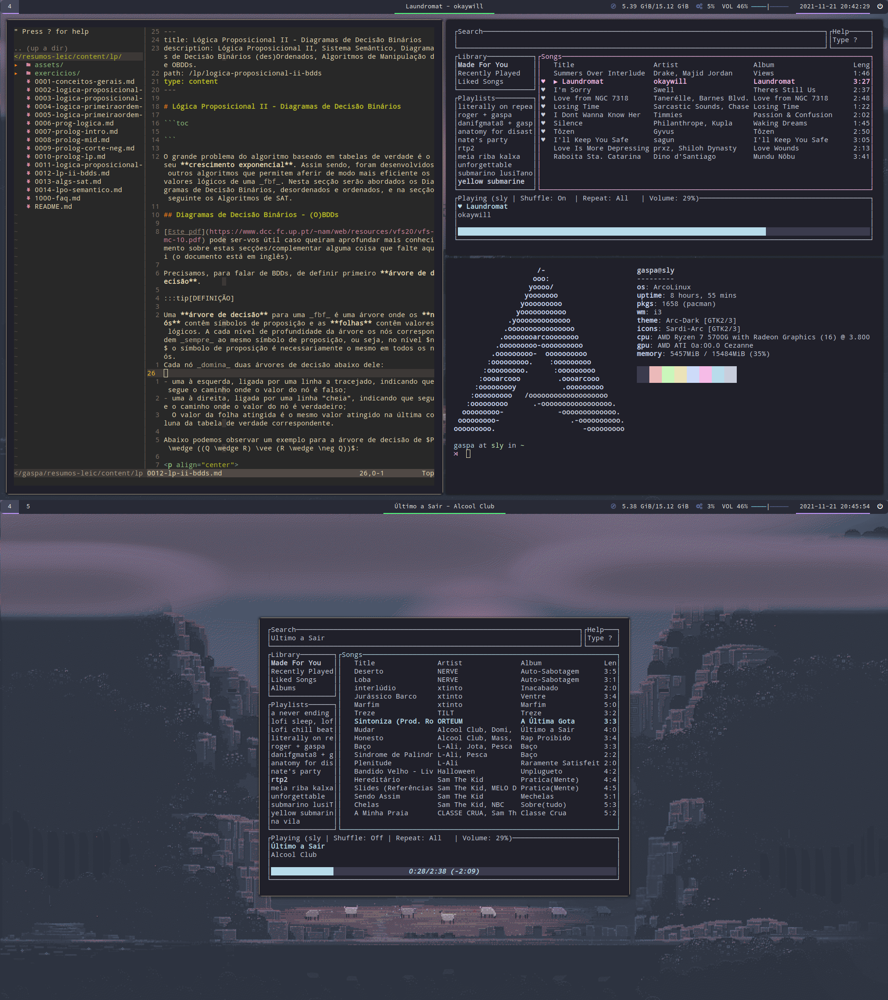

# gaspafiles

My Arch Linux dotfiles!
Shamelessly stolen bits and bobs from [Raf](https://github.com/RafDevX/dotfiles), [Diogo](https://github.com/diogotcorreia/dotfiles) and [RageKnify](https://gitlab.com/RageKnify/DotFiles). Check out their dotfiles!

Recently changed from daily driving dwm to i3 as my tiling window manager and have been loving it so far!

## Usage

```
git clone https://github.com/randomicecube/gaspafiles.git
cd gaspafiles
stow NAME # repeat for alacritty, nvim, etc
```

## Images


